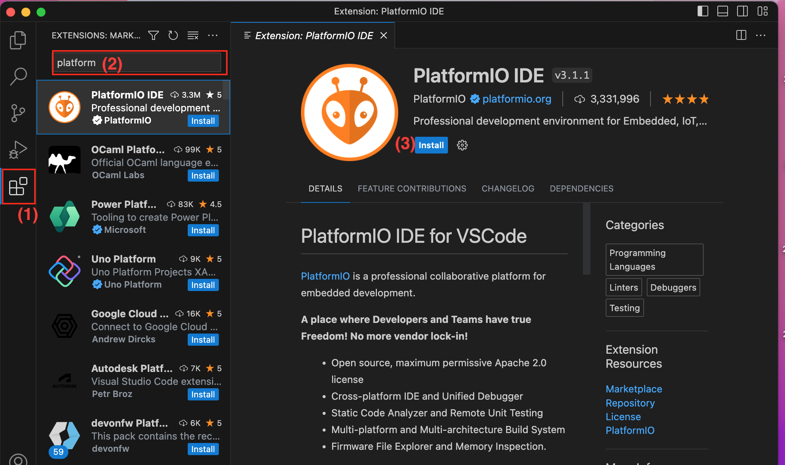
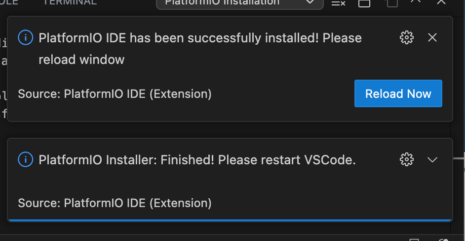
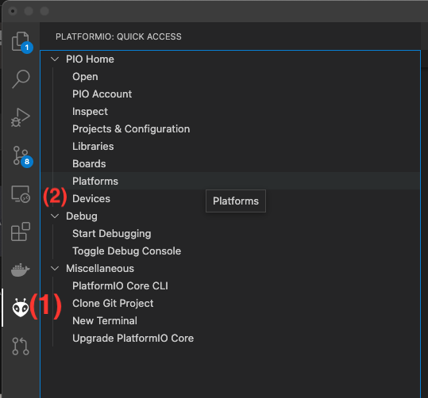
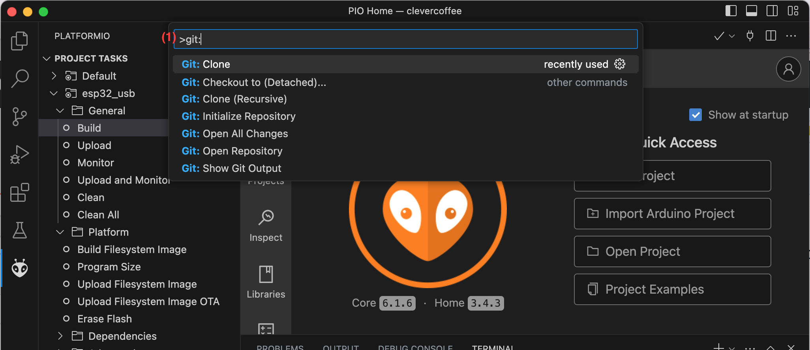
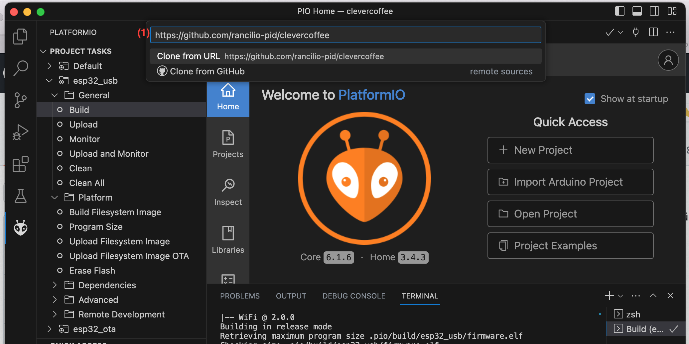
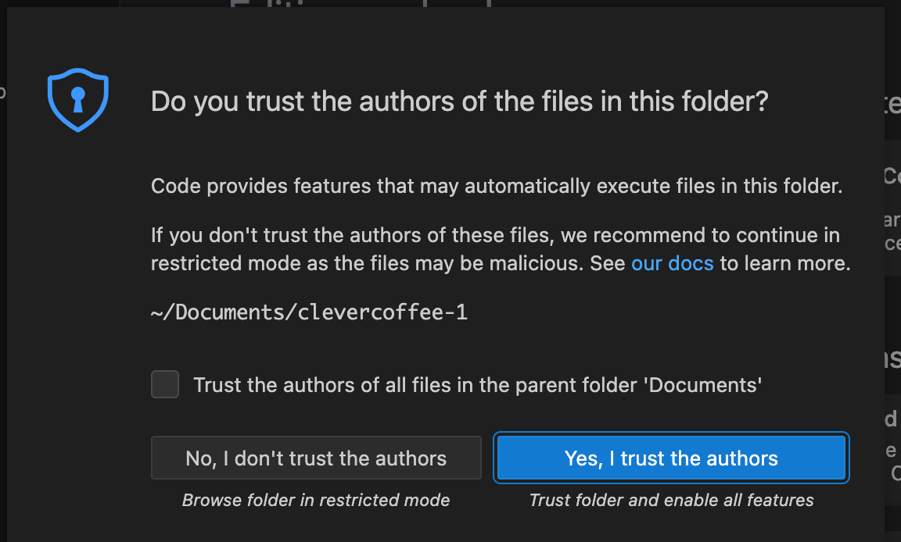

#   {{ page.title }}
{: .no_toc }

Inhaltsverzeichnis

* TOC
{:toc}


## Übersicht
Ab der Version 4 für den ESP32 beziehungsweise für den ESP8266 (ab Version 3.1.3) werden folgende Softwaretools benötigt:
* Visual Studio Code
* PlatformIO (eine Extension in VS Code)
* Git
* Treiber für den ESP32 / ESP8266


## Installation Visual Studio Code & PlatformIO

Gehe auf die Webseite von [Visual Studio Code](https://code.visualstudio.com/download) (VS Code) und lade deine entsprechende Version herunter.
Öffne VS Code.



Suche bei `Extensions` (1) nach `platformio` (2). Klicke `Install` (3) und PlatformIO wird installiert.

Hierbei kann unten rechts im Fenster eine Meldung zeigen, dass weitere Softwarepakete fehlen:


Zum Beispiel muss Python extern installiert werden. Durch den Klick auf `Install Python` (1) gelangt ihr in die Dokumentation von PlatformIO. Befolgt dort die weiteren Installationsschritte. Klickt dann in VS Code in der Meldung `Try again`.
Am Ende zeigt euch folgende Meldung, dass PlatformIO erfolgreich installiert wurde:



Ihr könnt aber zum aktuellen Stand ohne `git` oder GitHub Desktop nicht unseren Code kompilieren. Falls ihr dies doch tut erhaltet ihr zum Beispiel eine folgende Fehlermeldung:


Ihr könnt an dieser Stelle VS Code erst einmal schließen.


## Installtion git
Wir empfehlen euch git direkt zu installieren. Auf der [Webseite von git scm](https://git-scm.com/downloads) sind alle Wege beschrieben, um git alleine (ohne GUI Client) für MacOS, Windows oder Linux zu installieren. Hier geht der Weg via [homebrew](https://brew.sh) am schnellsten.


## Treiber ESP32 / ESP8266
Ihr benötigt gegebenenfalls einen Treiber für den ESP32 beziehungsweise ESP8266. Ihr könnt in PlatformIO überprüfen ob euer ESP32 / ESP8266 schon erkannt wird.

Klickt in VS Code unter auf das PlatformIO Symbol ("Ameisenkopf") (1) und wählt `Devices` (2).



Hier müsste der per USB verbundene ESP32 oder ESP8266 zu sehen sein:


Es müsste ein Gerät mit `CP2102` am usbserial-X auftauchen. Wenn dies nicht der Fall ist testet bitte nochmals einen zweites USB-Kabel (manche Kabel sind nur zum Laden geeignet).
Wenn hier immer noch kein ESP32 / ESP8266 auftaucht, müsst ihr den Treiber installieren:

[Treiber ESP32](https://www.silabs.com/developers/usb-to-uart-bridge-vcp-drivers)

Der Treiber sollte auch für den ESP8266 funktionieren, solange der gleiche Controller verbaut ist (`CP2102`).

WICHTIG! Nach der Installation muss der Rechner neugestartet werden!


## Auswahl der Software-Version für den ESP32
Nach dem Neustart des Rechners könnt ihr prüfen, ob ihr die Software kompilieren könnt.
Öffnet das Verzeichnis in VS Code, welches ihr in GitHub kopiert habt. `File` -> `Open Folder`.
In dem oberen Fall wäre dies `/Documents/Github/clevercoffee`.

In VS Code drückt ihr in MacOS `Shift` + `CMD` + `P` oder nutzt die Taskleiste von VS Code: `View` -> `Command Palette`.
Hier gebt ihr ein (1): `git: clone`



Damit kopiert ihr nun das Repository des Projektes von GitHub. Gebt nun in der oberen Eingabemaske folgende URL ein (1):
`https://github.com/rancilio-pid/clevercoffee`



In der nachfolgenden Meldung sucht ihr euch das Verzeichnis aus wohin das Repository kopiert werden soll, dann fügt mit `ADD to workspace` das kopierte Repository zu eurem Workspace hinzu.
Es kann eine Meldung kommen, ob ihr den AutorInnen innerhalb des Verzeichnisses vertraut, klickt hierbei auf `Yes, i trust the authors`.



In VS Code drückt ihr wieder in MacOS `Shift` + `CMD` + `P` oder nutzt die Taskleiste von VS Code: `View` -> `Command Palette`.
Hier gebt ihr ein (1): `git: checkout to`


Drückt Return oder klickt per Maus den Befehl an und es erscheint eine Auswahlliste aller verfügbaren Versionen des Projekts:


Für den ESP32 sind nur die Versionen ab 4.X.X relevant, in dieser Version wird nicht mehr der ESP8266 unterstützt.
Die Version `origin/master` ist die aktuelle Version der Entwicklung für den ESP32.

Die Version `origin/ESP8266-master` ist die alte Entwicklungsversion für den ESP8266. Hier gibt es nur noch Bugfixes. Die aktuelle Version für den ESP8266 ist jeweils die Version mit dem Zusatz `-esp8266` zum Beispiel: `v3.1.2-esp8266`

Wählt die aktuellste Version für den ESP32 aus. Es dauert ein paar Sekunden und dann sollte der Code heruntergeladen sein.


##  Kompilieren vorbereiten
Bevor ihr die Version kompilieren könnt, müssen noch kleinere Vorbereitungen passieren.
Geht in VS Code in den Verzeichnisbaum des Codes, öffnet den Ordner `/src` und benennt die `userConfig_sample.h` in `userConfig.h` um:


Ihr könnt nun in dieser Datei einige Dinge zu eurer Espresso Maschine einstellen. Diese sind auch ausführlicher später im Handbuch erläutert. Wichtig sind hier vor allem `ONLYPID` und die Konfiguration für den späteren Hostnamen oder die OTA Einstellungen. Die WLAN-Einrichtung für euer Netzwerk findet später direkt auf dem ESP32 per Access Point statt.


##  Kompilieren
Nun kann der Code kompiliert werden. Hierzu sind folgende Schritte notwendig:
Drückt wieder das Symbol von PlatformIO (rechts in der Leiste). Ihr könnt später per OTA auch Daten auf den ESP32 übertragen, aber aktuell muss dieser per USB bespielt werden. Der ESP32 muss hierbei per USB-Kabel angeschlossen sein.

Bei jeden Upload- oder Erase-Schritt auf den ESP32 kann es passieren, dass dies nicht sofort durchläuft.
WICHTIG: Haltet die Taste "Boot" auf dem ESP gedrückt (ohne Pins kurzzuschließen), dann kann ein Upload per USB durchgeführt werden (Bei OTA besteht später das Problem nicht).


Bei jedem Teilschritt das `SUCCESS` in der Konsole abwarten:
* (1) Daher wählt `esp32_usb` aus
* (2) `Erase flash` (Boottaste am ESP32 drücken) klicken, warten bis `SUCCESS`
* (3) `Build Filesystem Image` klicken, warten bis `SUCCESS`
* (4) `Upload Filesystem Image`, Boottaste am ESP32 (beim ESP8266 nicht notwendig) drücken bis aufsteigende Prozent zu sehen sind, warten bis `SUCCESS`
* (5) Unter dem Punkt `General` auf `Build` klicken, warten bis `SUCCESS`
* (6) `Upload` klicken, Boottaste am ESP32 drücken bis aufsteigende Prozent zu sehen sind, warten bis `SUCCESS`
* (7) Monitor zum ESP32 öffnen, dann sollte folgendes zu sehen sein:

```
[00:00:02] Connect to WiFi: "silvia"
*wm:[1] AutoConnect
*wm:[2] Setting Hostnames:  silvia
*wm:[2] Setting WiFi hostname
*wm:[2] ESP32 event handler enabled
*wm:[2] Connecting as wifi client...
*wm:[2] setSTAConfig static ip not set, skipping
*wm:[1] Connect Wifi, ATTEMPT # 1 of 3
*wm:[1] No wifi saved, skipping
*wm:[2] Connection result: WL_NO_SSID_AVAIL
*wm:[1] Connect Wifi, ATTEMPT # 2 of 3
```

Glückwunsch, der ESP32 (oder ESP8266) ist nun mit der Software bespielt, weiter geht es mit der Einrichtung des WLANs!
